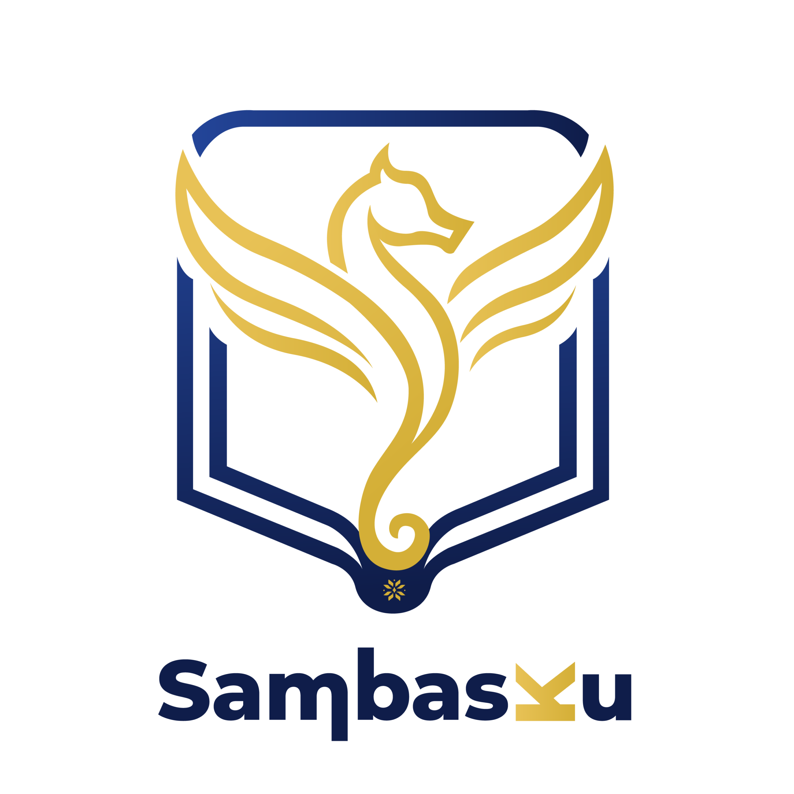

  

# SambasKu Reference

Dokumen di repositori ini adalah **acuan editorial**. Nanti isinya akan
menjadi sumber untuk artikel, dan artikel itulah yang dipakai sebagai
**acuan sumber data** di dalam aplikasi SambasKu (web dan mobile).

Bukan kode aplikasi. Bukan kontrak API. Fokusnya konten yang bisa
diverifikasi dan diangkat ke dalam produk sebagai rujukan data.

## Peran ke depan

| Tahap       | Peran                                                              |
| ----------- | ------------------------------------------------------------------ |
| Sekarang    | Kerangka dan catatan acuan konten                                  |
| Berikutnya  | Artikel disusun dari dokumen di sini                               |
| Di aplikasi | Artikel menjadi acuan sumber data yang ditampilkan / dirujuk klien |

Alur singkat: **dokumen acuan → artikel → sumber data di apps**.

## Sample daftar artikel

Contoh daftar artikel acuan (judul + tautan). Entri di bawah **contoh
saja**, belum jadi sumber data produksi.

Centang (`[x]`) = sudah diproses menjadi artikel / sumber data di apps.
Kosong (`[ ]`) = belum.

- [ ] [Bahasa Melayu Sambas](https://id.wikipedia.org/wiki/Bahasa_Melayu_Sambas)
- [ ] [Kabupaten Sambas](https://id.wikipedia.org/wiki/Kabupaten_Sambas)
- [ ] [Kamus Besar Bahasa Indonesia (KBBI) Daring](https://kbbi.kemdikbud.go.id/)
- [ ] [Portal Resmi Pemerintah Kabupaten Sambas](https://sambas.go.id/)
- [ ] [Badan Bahasa - Kementerian Pendidikan](https://badanbahasa.kemdikbud.go.id/)
- [ ] [Tradisi Saprah dalam Budaya Sambas](https://id.scribd.com/doc/212029904/Tradisi-Jamuan-Makan-Saprah-Masyarakat-Melayu-Sambas)
- [ ] [Digitalisasi Istana Alwatzikhoebillah](https://id.scribd.com/document/899328435/Istana-Alwatzikhubillah-Sambas)
- [ ] [Kekayaan Adat Istiadat Sambas](https://id.scribd.com/document/852601033/Adat-Istiadat-Sambas)
- [ ] [Kosakata Bahasa Melayu Sambas](https://id.scribd.com/document/621850403/Tugas-Kelompok-1-Bahasa-Sambas)
- [ ] [Kosakata dan Arti Bahasa Sambas](https://id.scribd.com/document/353956126/Bahasa-Sambas)
- [ ] [Tarian Tandak Sambas: Warisan Budaya Melayu](https://id.scribd.com/document/822966589/Tarian-tandak-sambas)
- [ ] [Kearifan Lokal dan Tradisi Sambas](https://id.scribd.com/document/821886947/p5-Kearifan-Lokal-Sambas)
- [ ] [Pepatah dan Arti Bahasa Sambas](https://id.scribd.com/document/388671238/Pepatah-Sambas-txt)
- [ ] [Tari Tandak Sambas: Sejarah dan Musik](https://id.scribd.com/presentation/781319448/Konsep-Pembelajaran-Tandak-Sambas)
- [ ] [Sejarah Masuknya Islam di Sambas](https://id.scribd.com/document/365711400/Sejarah-Islam-Di-Kesultaan-Sambas-Kalimantan-Barat)
- [ ] [Data Kependudukan Kabupaten Sambas 2024](https://id.scribd.com/document/905879001/Data-Agregat-Kependudukan-SAMBAS-Semester-I-2024)
- [ ] [Legenda Batu Ballah di Sambas](https://id.scribd.com/document/340070692/Cerita-Rakyat-Sambas-Batu-Ballah-Batu-Betangkup)
- [ ] [Mengenal Kabupaten Sambas](https://id.scribd.com/document/664191052/Mengenal-Kabupaten-Sambas)
- [ ] [Legenda Raden Sandhi dari Sambas](https://id.scribd.com/document/704798483/Bekesah-Raden-Shandi)
- [ ] [Warisan Budaya Tangible dan Intangible Sambas](https://id.scribd.com/presentation/615080853/Budaya-tangible-dan-intangible)
- [ ] [Tradisi Bedande: Cerita dan Musik Sambas](https://id.scribd.com/document/612880567/BEDANDE)
- [ ] [Tradisi Nyanggar di Kabupaten Sambas](https://id.scribd.com/document/505556956/semantik)
- [ ] [Tan Unggal: Raja Kejam Sambas](https://id.scribd.com/doc/250422020/Cerita-Tan-Unggal)
- [ ] [Silsilah Sultan Sambas dan Perkembangan Islam](https://id.scribd.com/document/688805656/20-Article-Text-74-1-10-20210209)
- [ ] [Kuliner Khas Sambas: Bubur Pedas](https://id.scribd.com/document/351551073/Suku-Melayu-Sambas-Di-Kalimantan-Barat)
- [ ] [Sastra Lisan dan Wisata di Sambas](https://id.scribd.com/document/731116482/44439-75676634091-1-SM-unlocked)
- [ ] [Sejarah dan Budaya Suku Sambas](https://id.scribd.com/document/951684990/Melayu-Sambas)
- [ ] [Hikayat Semangka Emas di Sambas](https://id.scribd.com/document/687438008/Pada-zaman-dahulu-kala)
- [ ] [Potensi Wisata Sejarah di Sambas](https://id.scribd.com/doc/136943083/wisata8)
- [ ] [Tradisi Tepung Tawar di Sambas](https://id.scribd.com/document/508875036/TUGAS-2-PENGANTAR-ANTROPOLOGI)
- [ ] [Wisata Halal di Pantai Bahari Sambas](https://id.scribd.com/document/607205061/jurnal-kelompok-2-sri-k-dan-eva)
- [ ] [Tradisi Bepapas di Sambas](https://id.scribd.com/document/397155675/Be-Papas)
- [ ] [Asal Usul dan Ciri Bubur Pedas Sambas](https://id.scribd.com/doc/283516564/Ppt-Bubur-Pedas-Kelompok-B-5)
- [ ] [Tari Tandak Sambas: Asal dan Makna](https://id.scribd.com/document/539691473/Tugas-Kritik-Tari-Arsy-X-mipa2)
- [ ] [Sejarah Kesultanan Sambas 1675 M](https://id.scribd.com/presentation/442714707/54243-kesultanan-sambas-pptx)
- [ ] [Statistik Kabupaten Sambas 2024](https://id.scribd.com/document/785904309/Kabupaten-Sambas-Dalam-Angka-2024)
- [ ] [Sejarah Islam di Kesultanan Sambas](https://id.scribd.com/presentation/433132429/Proposal-Penelitian-Sejarah)
- [ ] [222 Kosa Kata](https://github.com/januardi211-max/222-kosa-kata)
